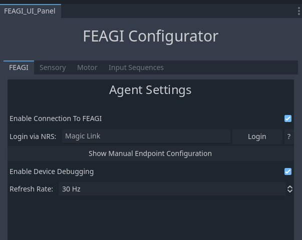
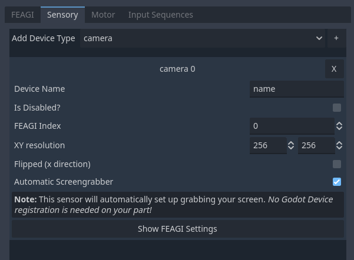
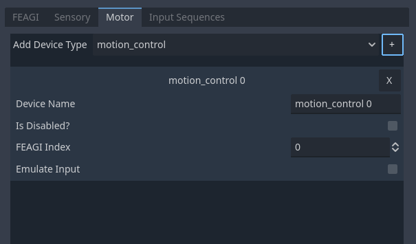
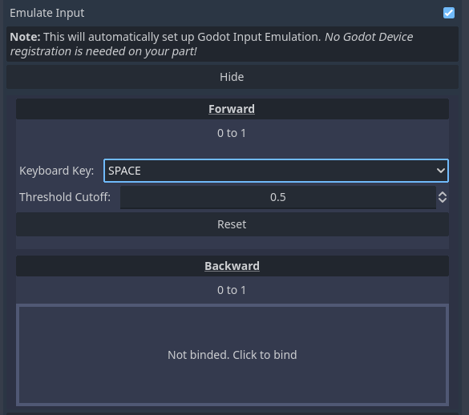
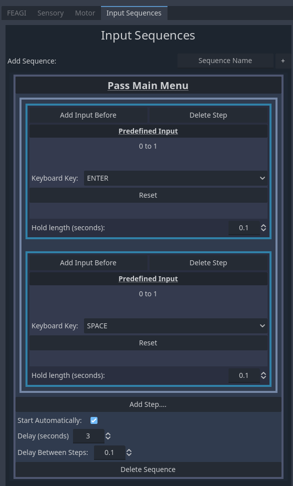

# Godot FEAGI Integration
## Easily have human neuron powered agents control your game!

This plugin for Godot allows an instance of FEAGI, either from our cloud platform at [NeuroRobotics Studio](https://neurorobotics.studio) or from a local instance, to play your game or act as an agent.

Please see general installation procedure [here](../README.md).

### Config Files

Saving the configuration will create config files that will be read by the plugin at runtime under your project path in a folder called "FEAGI_config". The "genome_mapping" resource files contains details about what in your game is mapped to what in FEAGI, which generally isn't sensitive information. The "endpoint" file contains your connection details. *__Since this file may contain sensitive information__, such as your NeuroRoboticsStudio login token, a gitignore file is also generated in this directory to avoid pushing it up by mistake, please be wary!* 

## Configurator overview

After installing the plugin (you may need to reload the Godot editor), you can access the FEAGI Configurator panel at Project -> Tools -> Open FEAGI Configurator. This configurator panel allows you to configure the details of your connection and data sent and recieved.

### Tab: FEAGI

This tab contains geneal settings for FEAGis connection, the option to toggle debugging (details below), FEAGI's connection details can be configured here. You can either define a magic link for connecting the NeuroRobotics Studio, or you can input connection details manually for a self hosted instance (defaults to default localhost settings).

### Tab: Sensory

The first of the IO related functions, this tab allows you to configure "sensory" devices that allow FEAGI to percieve your game. You can add devices using the top dropdown and clicking the add button, and each device can be configured. You can configure various properties per device. 

The camera sensor has an option to configure automatic screengrabbing, which automatically configures a virtual camera sensor on game start that records the entire screen perspective as this camera. Otherwise your game code will have to use a registration agent to configure how to send data. *Please note that enabling this feature marks the camera device as binded, so you cannot bind other registration agents to it.*

### Tab: Motor

The second of the IO related functions, this tab allows you to configure "motor" devices that allow FEAGI to interact with your game. Just as with sensors, you can add devices from the top dropdown, and then you can configure each device.

While you can (and in some cases would prefer to) manually define registration agents in code to handle game interactions given motor data from FEAGI, you can also use the input emulation system. 

This system allows parsing the motor devices input as an input for your game. Depending on the motor type, this can be a Godot Event directly, or it can be a keyboard press, mouse click, or other. You can use the built in UI to configure this to your liking. *Please note that enabling input emulation does mark that devices as binded such that other registration agents cannot bind to it.* 

### Input Sequences

This section is technically not for FEAGI directly, but allows you to specify sequences of inputs by name that can then be executed either automatically after game start (as per configuration) or manually in code by calling `FEAGI.sequences.play_sequence(*sequence name*)`. This is useful for having the game be able to bypass main menus on start, or go through death screens / dialogs without having to need FEAGI to understand it.

## Creating Custom IO devices

While having automatic input emulation and screen capture is nice and even sufficient in many cases, there may be times that getting or sending data to your game may be non-trivial. That is why this plugin allows configuring custom sensors and motors for FEAGI to interface with.

### Registration agents
Registration Agents are Godot Resources (so you can @export them in your code for easier configuration) that handle connecting your data source / sink to FEAGIs sensor / motors respectfully. They work by searching for the device type and name (case-sensitive) that you configured in the configurator, and passing in a custom function that you create for parsing / generating the required data. 

The easiest way to add them to your game is to add it to a script of a relevant node as an @export variable (make sure you use a `FEAGI_RegistrationAgent_Motor` or a `FEAGI_RegistrationAgent_Sensory` type! The base `FEAGI_RegistrationAgent_Base` cannot be used directly!. From the Godot Scene editor, you can then easily define the name of the FEAGI device you wish for it to bind to.

To actually have the registration device bind during runtime, you need to call the `(registration agent var).register_with_FEAGI(your_function_name)` with the function you intend to use for the device. What the function does internally depends on your use case and game, however there are some requirements depending on the device type:

__Sensors__: The function must not accept anything and return the relevant data type depending on the device type

| __Device Type__ | __Expected Return Data Type__ |
|--|--|
| Camera | [Image](https://docs.godotengine.org/en/stable/classes/class_image.html) |
| Gyro | [Vector3](https://docs.godotengine.org/en/stable/classes/class_vector3.html)
| Accelerometer | [Vector3](https://docs.godotengine.org/en/stable/classes/class_vector3.html)
| Proximity | [float](https://docs.godotengine.org/en/stable/classes/class_float.html)

__Motors__: The function must not return anything and instead accept a single parameter of the type expected by the motor type

| __Device Type__ | __Type of Data Passed into Parameter__ |
|--|--|
| Misc | [float](https://docs.godotengine.org/en/stable/classes/class_float.html)
| Motor | [float](https://docs.godotengine.org/en/stable/classes/class_float.html)
| Motion Control | FEAGI_Data_MotionControl (see info below)

Unfortunately due to lmiations of GDScript currently, it is not possible to define these limitations statically, and thus the editor will not guide you in using the correct data types. You will have to be wary of the above rules when creating the function to pass into the registration agent.
These functions will be called at about the same frequency of recieving / sending data to FEAGI (IE the refresh rate you defined). If for whatever reason you want to keep logic contained in _process loops or other structures, then one work around is to store the data to be read / written to to a member level variable of the script as a cache, and have your passed in function simply read and write to that variable as you use that variable in wherever else in your code.

__FEAGI_Data_MotionControl__: The "Motion Control" is a unique motor device of FEAGI since it encapsulates 12 directions of movement. For that reason, we created the *FEAGI_Data_MotionControl* object to encapsulate all that, where you can access / modify the different directions as properties, and also have access to helper functions to easily go from the raw float values that reach from 0 -> 1 into direction floats or vectors.

### Existing Custom IO devices
There exist some scripts within the addons directory, under `FeagiIntegration/RunTime/VirtualDevices` that you can use to simulate real world robitics sensors in game, or to see as an example for how to create a custom IO device using registration agents.

### Debugging
Debugging can be enabled under the FEAGI tab. When enabling, going under the Godot Debugger tab while running you will see a FEAGI Debug section active that will show all motor and sensors that have been defined, and their most recent value. This can be useful to debug any custom IO connectors to ensure they are behaving as expected. Do not that this feature does not work on exports, and is resource heavy so you may want to keep it disabled unless required. In addition, due to an engine issue, it may occasionally crash the editor while debugging. This again can be avoided by disabling the debugger if not using it.

In terms of dealing with other issues, the plugin prints in the logs its current status, which may guide you to resolving any issues. If you are having an issue you do not understand, please do not hesitate to open a Github issue or to reach out to us on Discord!

## Exporting your game.
This plugin supports exporting your game to PC and to Web exports. __Just be wary of potentially including your NeuroRobotics Studio login token with any shared builds!__